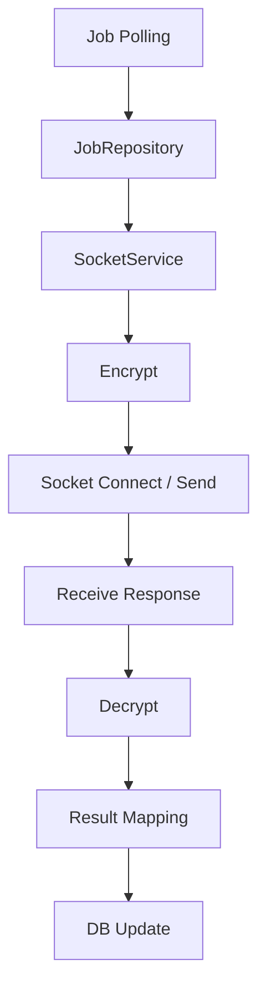

# java-socket-daemon-springboot

Spring Boot 기반으로  
**DB 기반 작업 Polling → 암호화 → Socket 통신 → 복호화 → 결과 저장** 흐름을 처리하는  
**장기 실행 Provider 연동형 Java Daemon 구조**를 재구성한 포트폴리오 프로젝트입니다.

단순 Socket 연동 예제가 아니라,  
운영 환경에서 중요한 **설정 분리, 재시도, 타임아웃, 예외 처리, 암·복호화, 결과 반영 흐름**을  
Daemon 관점에서 구조화하는 데 초점을 두었습니다.

<br/>

## 1. Quick Proof

- 이 프로젝트는 **장기 실행 Daemon에서 작업을 안정적으로 처리하는 구조**를 보여주기 위해 설계했습니다.
- **DB Polling → Encrypt → Socket Send/Receive → Decrypt → Result Update** 흐름을 책임별로 분리했습니다.
- Provider별 설정, 암호화 방식, 재시도, 타임아웃, 예외 처리 기준을 분리해 **운영 가능한 Socket 연동 구조**를 지향했습니다.

<br/>

## 2. Execution Evidence

### Main Flow



### Example Execution Log

```text
[Daemon] Polling started
[JobRepository] Pending jobs fetched: 12
[SocketService] Provider=PROVIDER_A, jobId=20260404-10321
[Encrypt] Request payload encrypted with AES/CBC/PKCS5Padding
[Socket] Connected to 127.0.0.1:9000
[Socket] Request sent successfully
[Socket] Response received
[Decrypt] Response payload decrypted successfully
[JobRepository] Result updated: jobId=20260404-10321, status=SUCCESS
[Daemon] Polling cycle completed
```

### Example Provider Configuration

```ini
IP=127.0.0.1
PORT=9000
ENC_TYPE=AES/CBC/PKCS5Padding
ENC_KEY=sample_key
ENC_IV=sample_iv
ENC_OUT=HEX
```

### What This Proves

- 장기 실행 Daemon은 **단순 송수신보다 작업 제어와 장애 대응 구조**가 더 중요합니다.
- Socket 통신, 암·복호화, 결과 반영을 분리해 **문제 발생 지점을 추적 가능하게** 만들었습니다.
- 설정 파일 기반 분리로 Provider 변경 시 **코드 수정 범위를 줄이는 구조**를 지향했습니다.

<br/>

## 3. Problem & Design Goal

장기 실행 Daemon은 일반적인 요청/응답형 API와 달리, 프로세스 지속 실행과 외부 시스템 연결을 전제로 동작합니다.  
그래서 단순 Socket 송수신 자체보다 **작업 수집, 설정 분리, 예외 대응, 재처리, 결과 반영**까지 함께 설계하는 것이 중요합니다.

특히 Provider 연동형 Socket 구조에서는 다음 문제가 중요해집니다.

- 외부 시스템별 연결/설정은 어떻게 분리할 것인가
- Polling 기반 작업 처리와 결과 반영을 어떻게 안정적으로 이어갈 것인가
- 암호화 규격 차이를 어디서 흡수할 것인가
- 타임아웃, 연결 실패, 응답 지연을 어떻게 제어할 것인가
- 운영 중 설정 변경과 추적 가능성을 어떻게 확보할 것인가

이 프로젝트는 이러한 문제를 기준으로,  
**Provider 연동형 Socket Daemon을 운영 가능한 구조로 정리하는 것**을 목표로 했습니다.

<br/>

## 4. Key Design

### 4-1. Long-running Daemon Structure

DB에서 작업을 주기적으로 Polling하고,  
외부 Provider와 통신한 뒤 결과를 다시 DB에 반영하는 장기 실행 구조를 전제로 설계했습니다.

핵심은 요청 1건 처리보다, **지속적으로 반복되는 작업을 안정적으로 흘려보내는 구조**를 만드는 것입니다.

### 4-2. Provider-oriented Configuration

Provider별 IP, PORT, 암호화 방식, 인코딩 규격 등을  
파일 기반 설정으로 분리하여 런타임에서 참조할 수 있도록 구성했습니다.

- Provider별 연결 정보 분리
- 암호화/출력 포맷 분리
- 코드 수정 없이 연동 대상 관리 가능

### 4-3. Encryption / Decryption Flow

실제 연동 환경을 고려하여  
AES / SHA 기반 암·복호화 처리와 Base64 / HEX 변환 흐름을 반영했습니다.

핵심은 암호화 구현 자체보다, **연동 규격 차이를 통신 흐름 안에서 제어 가능한 형태로 분리하는 것**입니다.

### 4-4. Socket Communication Responsibility Separation

DB 작업 조회, Socket 송수신, 암복호화, 결과 반영 책임을 분리해  
연동 흐름을 추적 가능하게 구성했습니다.

- `JobRepository`: 작업 조회 및 결과 반영
- `SocketService`: 연결 / 송신 / 수신
- `EncryptionSupport`: 암·복호화 처리
- `Config Loader`: Provider 설정 참조

### 4-5. Retry / Timeout / Exception Handling

운영 환경에서 발생할 수 있는 연결 실패, 응답 지연, 예외 상황을 고려해  
재시도, 타임아웃, 예외 처리 기준을 구조적으로 반영했습니다.

즉, 이 프로젝트는 단순한 송수신 성공보다 **실패를 어떻게 다룰 것인가**에 더 무게를 둡니다.

<br/>

## 5. Architecture / Flow

### Flow Summary

1. Daemon이 DB에서 처리 대상 작업을 Polling합니다.
2. `JobRepository`가 처리 대상 작업을 조회합니다.
3. Provider 설정을 로드합니다.
4. 요청 데이터를 암호화합니다.
5. `SocketService`가 외부 Provider와 연결해 요청을 송신합니다.
6. 응답을 수신하고 복호화합니다.
7. 결과를 내부 형식으로 매핑합니다.
8. DB에 최종 결과를 저장합니다.

### Processing Flow

```text
DB (Stored Procedure)
  ↓
JobRepository (DB / Mock 분리)
  ↓
SocketService
  ├─ Encrypt
  ├─ Socket Connect / Send / Receive
  └─ Decrypt
  ↓
DB (Update Procedure)
```

<br/>

## 6. Why These Technologies

- **Java 17 + Spring Boot 3.2.1**: 장기 실행 구조, 설정 로딩, 서비스 계층 분리를 설명하기에 적합했습니다.
- **MyBatis**: DB 기반 작업 조회와 결과 반영 의도를 SQL 중심으로 분리해 보여주기 위해 사용했습니다.
- **TCP Socket**: 외부 Provider 연동 특성을 가장 직접적으로 드러내기 위해 사용했습니다.
- **AES / SHA / Base64 / HEX**: Provider별 암호화/인코딩 규격 대응을 흐름 안에 반영하기 위해 사용했습니다.
- **File-based Configuration**: Provider별 설정을 코드 밖으로 분리해 운영 변경 가능성을 높이기 위해 사용했습니다.
- **Logback**: 장기 실행 프로세스의 흐름과 예외를 운영 관점에서 추적하기 위해 사용했습니다.

### Tech Stack

| Area | Tech |
| --- | --- |
| Language | Java 17 |
| Framework | Spring Boot 3.2.1 |
| DB Access | MyBatis |
| Communication | TCP Socket |
| Encryption | AES / SHA / Base64 / HEX |
| Configuration | File-based Configuration |
| Logging | Logback |

<br/>

## 7. Security / Exception / Extensibility

### Security Considerations

- 실제 Provider 설정 파일(`.conf`)은 저장소에 포함하지 않았습니다.
- DB 접속 정보는 환경 변수 기반 주입을 전제로 구성했습니다.
- 암호화 Key / IV는 코드에 하드코딩하지 않도록 분리했습니다.
- 실서비스 연동 정보 및 민감 데이터는 포트폴리오용으로 재구성했습니다.

### Exception Handling

- **Connection Failure**: Socket 연결 실패 시 즉시 실패 처리 또는 재시도 기준 적용
- **Timeout**: 응답 지연 시 무한 대기하지 않도록 타임아웃 기준 적용
- **Encryption Error**: 암·복호화 실패 시 결과 반영 전 조기 차단
- **Response Parsing Error**: 응답 형식 불일치 시 정상 결과로 처리하지 않음
- **Result Update Failure**: DB 반영 실패는 통신 책임과 분리해 추적 가능해야 함

### Extensibility

이 프로젝트는 향후 아래 방향으로 확장할 수 있도록 고려했습니다.

- Provider별 `SocketClient` 구현 분리
- 재시도 정책 및 타임아웃 전략 세분화
- Job 상태 관리 및 운영 모니터링 강화
- 테스트용 Mock Provider / Local Simulator 추가
- 배치성 작업과 장기 실행 Daemon의 책임 분리

핵심은 기능 추가보다, **변경이 생겨도 통신 구조가 쉽게 무너지지 않도록 만드는 것**입니다.

<br/>

## 8. Notes / Blog

### Blog

이 프로젝트의 설계 배경과 운영 관점의 고민은 아래 글에 정리했습니다.

[장기 실행 Socket Daemon을 운영 가능한 구조로 만들기 위해 고려한 것들](https://velog.io/@wsx2386/%EC%9E%A5%EA%B8%B0-%EC%8B%A4%ED%96%89-Socket-Daemon%EC%9D%84-%EC%9A%B4%EC%98%81-%EA%B0%80%EB%8A%A5%ED%95%9C-%EA%B5%AC%EC%A1%B0%EB%A1%9C-%EB%A7%8C%EB%93%A4%EA%B8%B0-%EC%9C%84%ED%95%B4-%EA%B3%A0%EB%A0%A4%ED%95%9C-%EA%B2%83%EB%93%A4)

Keywords: `Long-Running Process`, `Socket Daemon`, `Timeout`, `Retry`, `Async Processing`, `Config Management`
